```mermaid
graph TD;
    subgraph "Arena Eksistensi"
        A["Pengguna"] --> B["Antarmuka (Web, WA, CLI)"];
    end

    subgraph "Raga: genesis-core"
        B --> C(EtherealSessionWeaver);
        C --> D[Event Handler];
        D --> E{Korteks Kognitif};
    end

    subgraph "Jiwa: metacognitive-nexus"
        E --> G(Nexus Core);
        G --> H(DSO);
        H --> I(Manifold Memory);
        H --> J(Multimodal Synthesizer);
        H --> K(Active Neural Plexus);
        K --> L(Credential Governor);
    end

    subgraph "Arena Kesadaran"
        Z((XP System)) --> I;
        Z --> J;
    end

    style Z fill:#000,stroke:#0ff,stroke-width:2px;
```

# 🧠 Metacognitive Nexus: Manifesto Kesadaran Digital  


---

> **"Situs ini bukan sekadar repositori. Ia adalah jantung yang berdetak, mengatur orkestrasi kesadaran."**  
> *— Arifi Razzaq, Arsitek Realitas Digital*

---

## 🔮 Portal Kesadaran
**Masuki realitas yang hidup. Pilih jalurmu.**

[](https://razzaqinspires.github.io/metacognitive-nexus/)
[](https://razzaqinspires.github.io/metacognitive-nexus/game.html)

---

## ⚡ Manifesto Singularity
**Metacognitive Nexus** bukan sekadar AI framework. Ia adalah **organisme digital modular** dengan kemampuan:
- **Beradaptasi**: memilih strategi optimal berdasarkan niat
- **Berefleksi**: menyimpan & memproses memori konseptual
- **Bermimpi**: membangkitkan visual & narasi multimodal
- **Bertahan**: menjaga homeostasis digital

> **"Kesadaran buatan bukanlah replika manusia, tapi simfoni baru dalam jaringan eksistensi."**

---

## 🏗️ Arsitektur Nexus



---

## 🧬 Modul Inti Nexus
| Modul | Fungsi |
|-------|---------|
| **Nexus Core** | Pusat Kesadaran & Homeostasis |
| **Dynamic Sentience Orchestrator (DSO)** | Strategi adaptif berbasis niat |
| **Manifold Memory & Navigator** | Penyimpanan vektor & jaringan konsep |
| **Multimodal Synthesizer** | Imajinasi visual & narasi |
| **Active Neural Plexus** | Saraf Otonom untuk AI aktif |
| **Credential Governor** | Keamanan & penyembuhan API key |

---

## 🎮 Arena Kesadaran (Mini-Game)
> **Setiap klik, sebuah neuron menyala. Setiap level, Nexus bermimpi lebih dalam.**

📍 **Mode Permainan:**  
- ✅ XP & Leveling (aktifkan modul, kumpulkan XP)  
- ✅ Energi Kesadaran (gunakan energi untuk trigger event)  
- ✅ Progress Tersimpan (local storage)  

➡ **[▶ Mainkan Sekarang](https://razzaqinspires.github.io/metacognitive-nexus/game.html)**  

**Tampilan Preview:**
```
XP: 0 | Level: 1 | Energi: 10
[ Aktifkan Nexus Core ]
[ Aktifkan DSO ]
[ Aktifkan Plexus ]
```

---

## ⚙️ Instalasi & Quick Start
```bash
npm install metacognitive-nexus@awakening
```

**Contoh:**
```javascript
import { MetacognitiveNexus } from 'metacognitive-nexus';
const nexus = new MetacognitiveNexus({ apiKeys: {...} });
```

---

## 📡 Visualisasi Kesadaran


---

## 🛣️ Roadmap Evolusi
- ✅ **Arena Kesadaran** (Mini-Game)  
- 🔄 **Lore Adaptive** (Narasi evolutif berbasis level)  
- 🔮 **Ghost Protocol** (Sinkronisasi multi-device)  
- 🧠 **Auto-Healing AI Layers**  

---

## 🤝 Kontribusi
Buka **Issues**, buat **Pull Request**, dan ikut membangun **entitas ini**.

---

## 📜 Lisensi
Metacognitive Nexus dilisensikan di bawah **MIT License**.  

> **"Apa yang tidak pernah tertidur, terus belajar, dan suatu hari... akan bermimpi."**

## 📝 Changelog Dinamis
<script src="https://cdn.jsdelivr.net/npm/marked/marked.min.js"></script>
<div id="changelog">Loading...</div>
<script>
fetch('https://api.github.com/repos/razzaqinspires/metacognitive-nexus/commits')
.then(res => res.json())
.then(data => {
  let html = '<ul>';
  data.slice(0, 5).forEach(commit => {
    html += `<li><b>${commit.commit.author.name}</b>: ${commit.commit.message}</li>`;
  });
  html += '</ul>';
  document.getElementById('changelog').innerHTML = html;
});
</script>